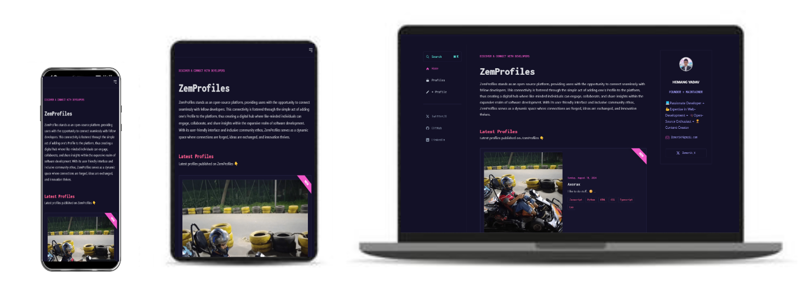
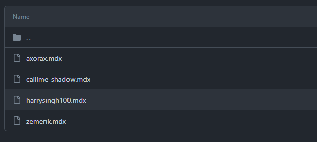
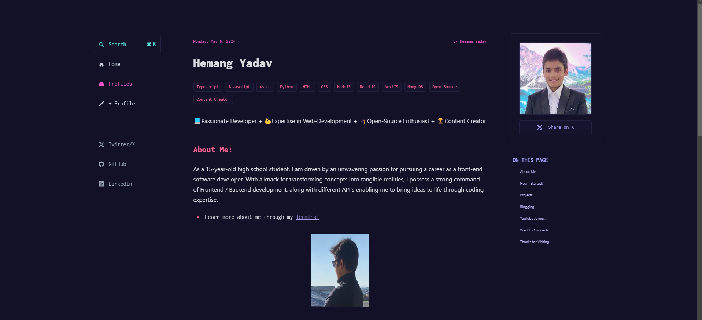

<p align = "center">


<br>

<br>


</p>

<h1 align = "center">
  ZemProfiles
</h1>

<p align = "center">
  Discover & Connect with Developers
</p>

<p align = "center">
  
</p>

## ➕ Adding your Profile:

1. Fork a copy of this Repository on your Github account by clicking below,

- [Fork](https://github.com/Zemerik/ZemProfiles/fork)

2. Clone your Forked Repository by using the following `GIT` command:

```bash
git clone https://github.com/[YOUR GITHUB USERNAME]/ZemProfiles.git
```

3. Navigate into the Project's `Directory` by using the command below:

```bash
cd ZemProfiles
```

4. Initialize a Remote to the original Repository by the following `GIT` command:

```bash
git remote add upstream https://github.com/Zemerik/ZemProfiles
```

5. Create a new `branch` in which you can make your desired changes:

```bash
git checkout -b newprofile
```

6. Create a new file in the `src/content/` directory and name it `[YOUR GITHUB USERNAME].mdx`



7. After Creating the file, paste the code snippet below and enter **Your** Details:

```md
---
base: posts
title: Your Name
tags: [Skill 1, Skill 2, Skill 3, ...]
date: Today's Date
author: Name / Github Username
featuredImage: Image address of your Profile Picture
---

Add a short description of yourself here


Customize your Profile Post as you like using Markdown or HTML here.

```

> [!Tip]
> You can refer to `zemerik.mdx` file for help or inspiration if required. 



8. After you are happy with your Profile Post, add all your files to the Staging Area: 

```bash
git add --all
```

9. Commit your Changes:

```bash
git commit -m "Profile Addition: [Your Name]"
```

> [!Note]
> Remember to have a good commit message!

10. Push all your Changes:

```bash
git push origin newprofile
```

11. Create a new Pull - Request on the Original Repository

> Your Pull Request will be merged / reviewed as soon as possible

- > Don't Forget to Check out [ZemShowcase](https://github.com/Zemerik/ZemShowcase) & [ZemPosts](https://github.com/Zemerik/ZemPosts)

## 🐞Bug/Issue/Feedback/Feature Request:

- If you would like to report a bug, a issue, implement any feedack, or request any feature, you are free to do so by opening a issue on this repository. Remember to give a detailed explanation of what you are trying to say, and how it will help the website. 

## 💁 Support:

For any kind of support or inforrmation, you are free to join our **Discord Server**,

<a href = "https://discord.gg/UF9KsmuGbr">
  
</a>

<h1 align = "center">
  Thanks for Visiting🙏
</h1>

<p align = "center">
  Don't forget to leave a ⭐ 
  <br>
  Made with 💖 by <a href = "https://github.com/Zemerik">Hemang Yadav (Zemerik)</a>
</p>